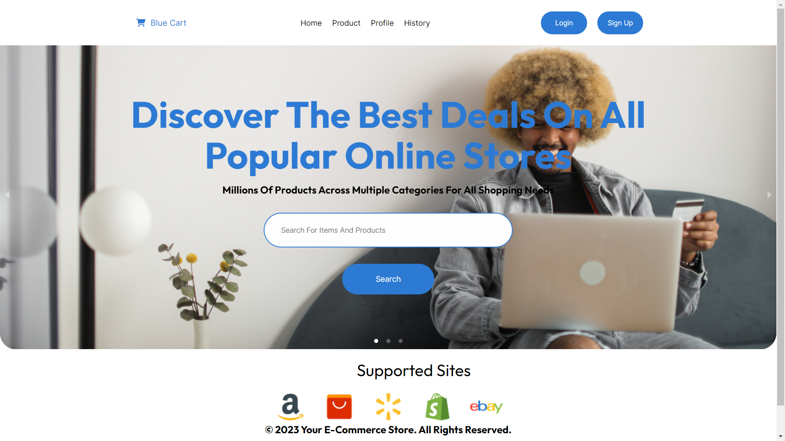
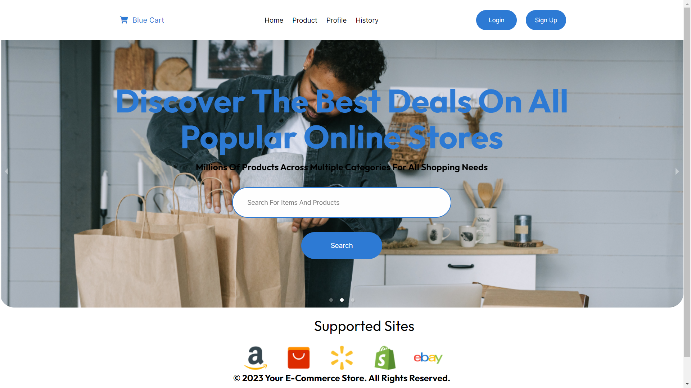
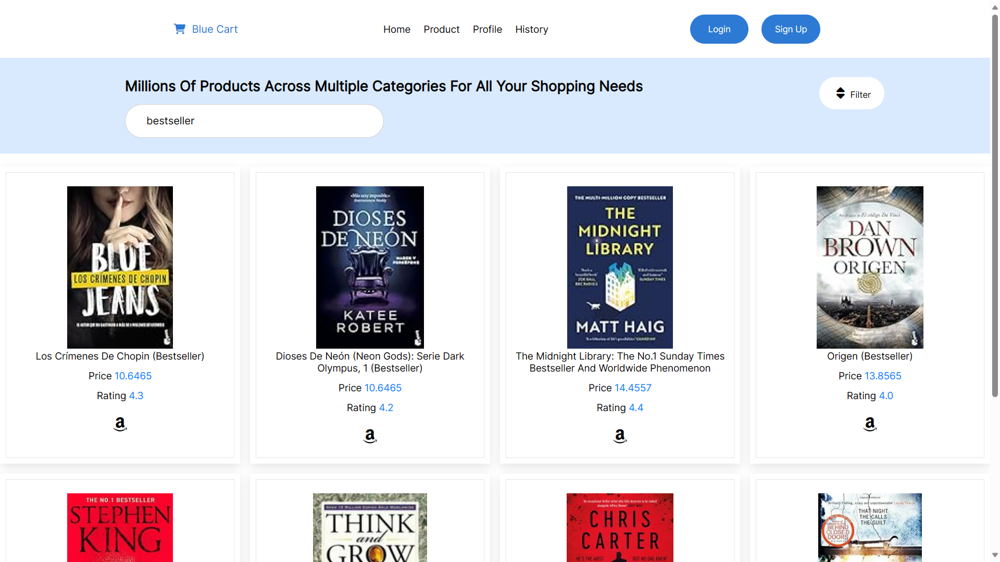
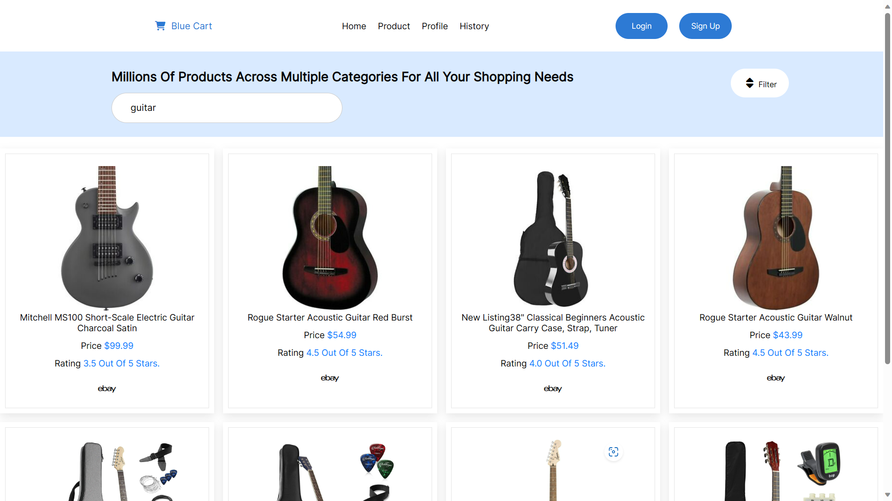
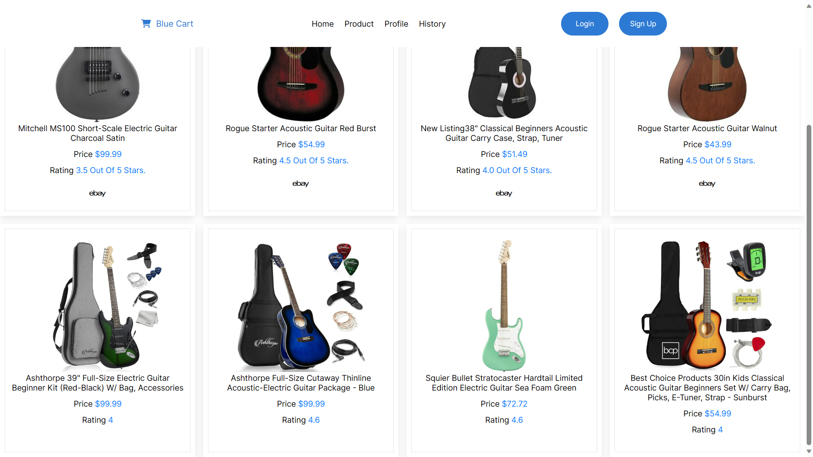
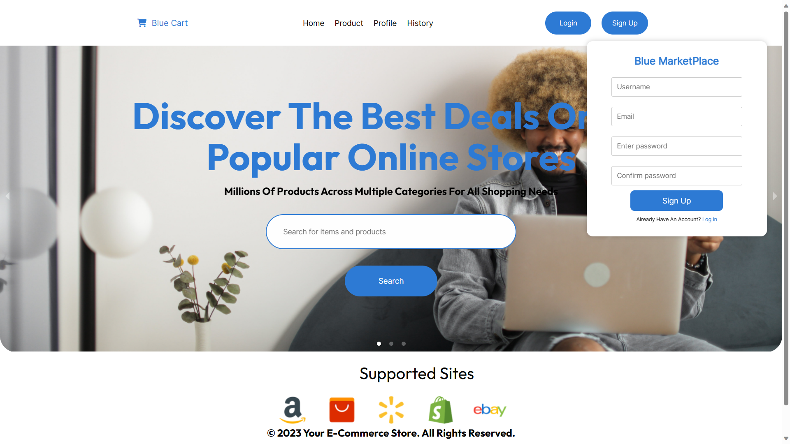
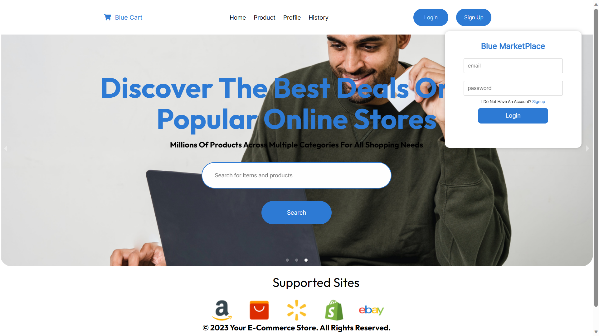
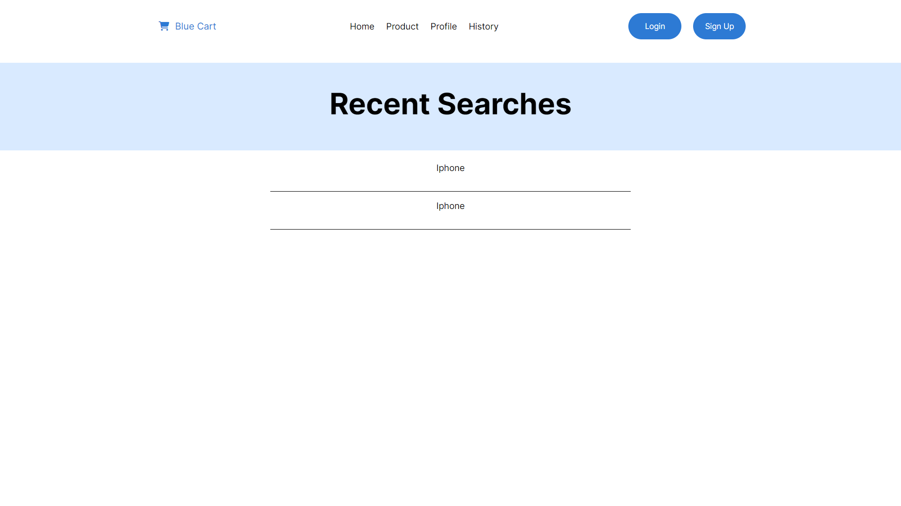

# BlueCart Marketplace Store
One of the major issues facing the rapidly growing online shopping community is lack of a tool that is able to automatically compute the marginal benefit(MB) and the cost benefit (CB) analysis of purchasing product A from e-shop X; product B from e-shop Y, or product A and B all from e-shop X or e-shop Y.

This owes to the fact that both shops may have the same product, but the MB and CB are highly subjective to factors such as shipping costs which may differ from e-shop X to Y, consumer ratings for each products in the two stores, quality, price among others

BlueCart is an e-commerce website that focuses on providing solutions for marginal benefit and cost benefit. 
BlueCart Marketplace is built using React and Python (Flask)

## Features

##### User Registration and Authentication
Users can create an account and log in to access personalized features.
If a user is not logged in they cannot be able to access their search history. The profile is also only available only upon creating an account with Bluecart Marketplace

#### Product Catalog
Browse and search for products available on the platform.

#### Marginal Benefit and Cost Benefit Analysis
Provides insights into the marginal benefit of purchasing a product and helps users understand the cost benefit of their purchases.

## Deployment Link
[BlueCart Marketplace - https://bluecart-marketplace-rouge.vercel.app/](https://bluecart-marketplace-rouge.vercel.app/)

# Setup Requirements 
- Visual Studio Code, see [here](https://code.visualstudio.com/)
- Windows Subsystem for Linux (WSL), details [here](https://learn.microsoft.com/en-us/windows/wsl/install)
- Git and Github for version control and collaboration
- Node.js (npm), see [here](https://nodejs.org/en)
- Optionally, set-up and customize the API. Update the project links to match your API links. Read the API setup guide, visit [BlueCart Marketplace API](https://github.com/eugenemrg/bluecart-marketplace-api)

# Installation

- Copy/Clone the repository
```
git clone git@github.com:eugenemrg/bluecart-marketplace.git
```

- Install the required dependencies
```
cd bluecart-marketplace
npm install
```

- Start the development server
```
npm run dev
``` 
- Access the BlueCart website in your browser at http://localhost:5173/ or a similar url


# Screenshots
Landing Page





Product / Item Search






Log In / Sign Up





Search History



# Technologies Used
- Javascript
- [React](https://react.dev/) - A library for building web and native user interfaces

# References
- Moringa Canvas
- W3Schools
- Mozilla Developers
  
# Contributing
Contributions are welcome. Reach out to any of the authors or our community to get on board.

# Author(s)
BlueCart Marketplace Store was created by:

- Micah Barasa
- Victor Njoroge
- [Eugene Aduogo](https://github.com/eugenemrg/)
  
# Team
BlueCart Marketplace project members:

- [Eugene Aduogo](https://github.com/eugenemrg/)
- Kenneth Mwangi 
- Micah Barasa
- Nicole Mugeshi
- Victor Njoroge

# License
BlueCart Marketplace

Copyright (C) 2023

Licensed under GNUv3. See [license](/LICENSE)

This program is free software: you can redistribute it and/or modify
it under the terms of the GNU General Public License as published by
the Free Software Foundation, either version 3 of the License, or
(at your option) any later version.

This program is distributed in the hope that it will be useful,
but WITHOUT ANY WARRANTY; without even the implied warranty of
MERCHANTABILITY or FITNESS FOR A PARTICULAR PURPOSE.  See the
GNU General Public License for more details.

You should have received a copy of the GNU General Public License
along with this program.  If not, see <https://www.gnu.org/licenses/>.